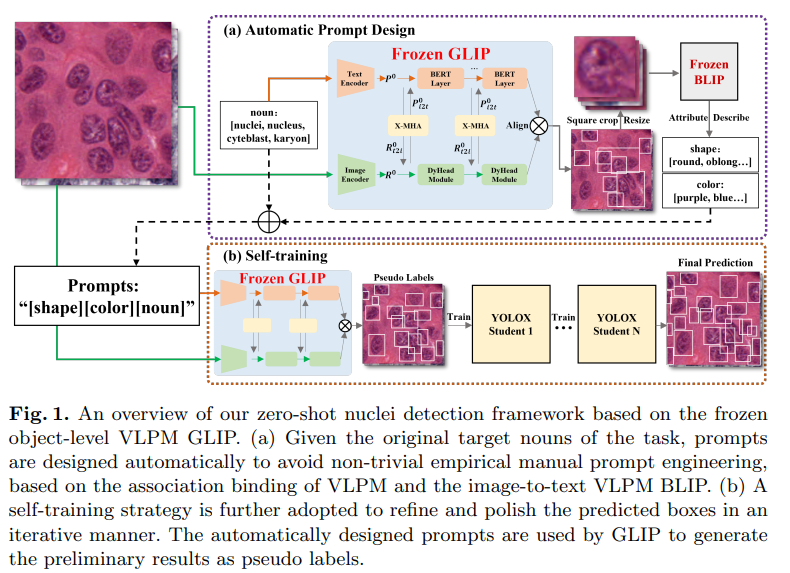

# Zero-shot Nuclei Detection via Visual-Language Pre-trained Models



Official implementation of Zero-shot Nuclei Detection via Visual-Language Pre-trained Models.
The original paper link is here:
[arXiv link](to be update), [MICCAI link](to be update).
The proposed method has two process steps:
1.Generating raw GLIP prediction result.
2.Self-training via YOLOX .
This repository provides source code for the first step.Code for second step is [here](https://github.com/wuyongjianCODE/VLPMNuD_part2).
## Installation
1.Create a Python environment based on ```requirements.txt``` file.

2.Build up GLIP.
Our project is developed based on [GLIP](https://github.com/microsoft/GLIP).

```bash 
cd sick/GLIP
python setup.py develop
```
This instruction will install a ```maskrcnn_benchmark``` libiary, which is required by GLIP.

3.[Optional] We recommend to install ```transformers``` libiary from source code , which enable us to change some function inside the transformer backbone.If you have installed transformer via pip and only want to reproduce the experiment result in our paper, you can also skip this step.This option is intended for further development.
You firstly need to uninstall transformer via pip or conda.
Then:
```bash 
cd github_src/transformers
python setup.py develop
```
## Dataset Introduction

For the convenience of downloading and using, we directly placed the dataset inside the project.It is located in DATASET/coco.For a dataset of tens of MB, it is far more convenient to use ```git clone``` directly than to download it from a network disk.
It was originally a MoNuSAC dataset and has been customized into COCO dataset format by us. This path will be directly called in the code, so it is not recommended to modify its path.
Making it easy for others to reproduce initial results is the original intention of our team, sincerely.

## Test : Generate the raw GLIP prediction result
Before testing, please download pretrain weights of [GLIP large model](https://huggingface.co/GLIPModel/GLIP/blob/main/glip_large_model.pth).
Then:
```bash 
python tools/test_grounding_net_wuap.py --config-file configs/pretrain/glip_Swin_L.yaml --weight glip_large_model.pth 
--prompt 'rectangular black nuclei. circle black nuclei. spherical black nuclei. rectangular dark purple nuclei. circle dark purple nuclei. spherical dark purple nuclei.' TEST.IMS_PER_BATCH 1 MODEL.DYHEAD.SCORE_AGG "MEAN" TEST.EVAL_TASK detection MODEL.DYHEAD.FUSE_CONFIG.MLM_LOSS False OUTPUT_DIR OUTPUT
```
Caution: ```--prompt``` param here gives an example prompt obtained from [blip](to be update), you can also input other prompts.
A json file recording all bbox will be generated in ```./jsonfiles```.Normally, the mAP score of raw glip should be in range [0.15, 0.2].Then you can use the predict result (i.e. the json file) to run self-training algorithm, and you will get near SOTA score (range [0.4, 0.45]).We provide our self-training source code [here](https://github.com/wuyongjianCODE/VLPMNuD_part2).

## [Optional] Self-Training GLIP using generated raw GLIP prediction
We provide an alternative way to get near SOTA score, in case that you feel YOLOX-based self-training process too complicate and labor-consuming.
You can feed raw GLIP predict back to GLIP itself, train a new GLIP model with unchanged pretrain weights(i.e. the glip_large_model.pth), and will get a better score,probably mAP in range [0.35, 0.45].You can repeat this process again and again.This optional method is actually GLIP-based self-training, rather than YOLOX-based self-training.
It is equivalent to YOLOX-based self-training, and you may be happy to avoid building up a YOLOX project.
We placed our example raw GLIP prediction file to the path:```DATASET/coco/annotations/instances_train2017_0166.json```,this result get mAP = 0.166.
Example instructions are following:
```bash 
python tools/train_net.py --config-file configs/pretrain/glip_Swin_L.yaml --train_label "DATASET/coco/annotations/instances_train2017_0166.json" --restart True --use-tensorboard 
--override_output_dir OUTPUT_TRAIN_fanew MODEL.BACKBONE.FREEZE_CONV_BODY_AT 1 SOLVER.IMS_PER_BATCH 1 SOLVER.USE_AMP True SOLVER.MAX_EPOCH 4 TEST.DURING_TRAINING True TEST.IMS_PER_BATCH 1 SOLVER.FIND_UNUSED_PARAMETERS False SOLVER.BASE_LR 0.00001 SOLVER.LANG_LR 0.00001 DATASETS.DISABLE_SHUFFLE True MODEL.DYHEAD.SCORE_AGG "MEAN" TEST.EVAL_TASK detection AUGMENT.MULT_MIN_SIZE_TRAIN (800,) SOLVER.CHECKPOINT_PERIOD 100
```
Other example instructions : (you must install the ```transformers``` libiary from github_src as mentioned in Installation,because we change some layers and functions in transformer for better mAP score )
```bash 
python tools/train_net.py --config-file configs/pretrain/glip_Swin_L.yaml --train_label "/data2/wyj/GLIP/DATASET/coco/annotations/instances_train2017_0166.json" --restart True --use-tensorboard --override_output_dir OUTPUT_TRAIN_fanew MODEL.BACKBONE.FREEZE_CONV_BODY_AT 1 SOLVER.IMS_PER_BATCH 1 SOLVER.USE_AMP True SOLVER.MAX_ITER 500 TEST.DURING_TRAINING True TEST.IMS_PER_BATCH 1 SOLVER.FIND_UNUSED_PARAMETERS False SOLVER.BASE_LR 0.00001 SOLVER.LANG_LR 0.00001 DATASETS.DISABLE_SHUFFLE True MODEL.DYHEAD.SCORE_AGG "MEAN" TEST.EVAL_TASK detection AUGMENT.MULT_MIN_SIZE_TRAIN (800,) SOLVER.CHECKPOINT_PERIOD 100 SWINBLO 3 lang_adap_mlp 2
```

## Citation

If you use VLPM in your work or wish to refer to the results published in this repo, please cite our paper:
```BibTeX

```


